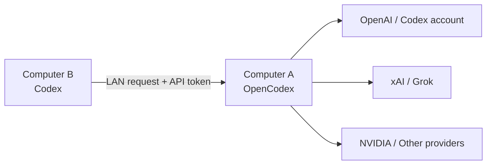

# OpenCodex LAN Codex Guide

> Share one OpenCodex instance with Codex on another trusted LAN computer.

[中文说明](#中文) | [English](#english)

## 中文

这个仓库说明如何让 A 电脑运行 `opencodex`，并让同一局域网内的 B 电脑上的 `Codex` 将模型请求转发到 A 电脑。B 电脑仍使用自己的 Codex 客户端，但可以复用 A 电脑已经接入的模型和 Provider。

适合以下场景：

- A 电脑负责运行和维护 `opencodex`。
- B 电脑只安装并登录 `Codex`，无需再部署一套 OpenCodex 服务。
- 两台设备位于同一个可信局域网。

完整安装、Windows 防火墙、Token 配置、模型目录同步、验证与排障，请阅读：[完整中文教程](./LAN-CODEX-TUTORIAL.md)

### 安全提示

- 仅在自己信任的局域网中开放服务。
- API Token 相当于访问凭证，不要截图、不要提交到 Git，也不要发送给不可信的人。
- 不要将服务端口直接暴露到公网；如需远程使用，请先做好访问控制与加密。

## English

This repository explains how to run `opencodex` on Computer A and route Codex requests from Computer B through that trusted local-network server. Computer B still uses its own Codex client, while requests can use the models and providers configured on Computer A.

This guide is intended for a trusted LAN where:

- Computer A runs and maintains `opencodex`.
- Computer B runs and signs in to `Codex`; it does not need another OpenCodex service.
- Both computers can reach each other on the same local network.

For the full setup, Windows Firewall rules, token configuration, model catalog sync, verification, and troubleshooting, see the [full Chinese guide](./LAN-CODEX-TUTORIAL.md).

### Security note

- Share the service only on a LAN you trust.
- Treat the API token as a credential. Never commit or share it publicly.
- Do not expose the service port directly to the public internet without proper access control and encryption.

## Acknowledgement

This guide is built around [lidge-jun/opencodex](https://github.com/lidge-jun/opencodex). Thanks to the original project and its maintainers.

## License

This repository contains documentation only. Please follow the upstream project's license and terms when using OpenCodex.
