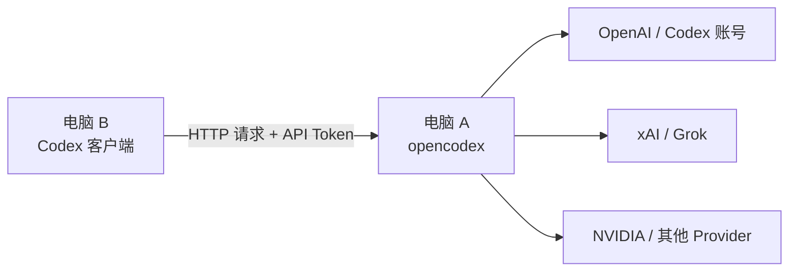

# OpenCodex 局域网共享 Codex 教程

> 让一台电脑运行 `opencodex`，另一台已经登录 `Codex` 的电脑通过局域网直接复用它的模型与账号能力。

**English:** [Read the complete English guide](./README_EN.md)

## 致谢与上游项目

本教程基于上游开源项目 [lidge-jun/opencodex](https://github.com/lidge-jun/opencodex) 实现。请先访问该仓库了解 OpenCodex 本身的安装、许可证与最新功能。
如果你准备将本文转载、整理或继续扩展，建议同时附上原项目链接，感谢原作者的工作。

---

## 这篇教程适合谁

适合下面这种场景：

- A 电脑运行 `opencodex`
- B 电脑运行 `Codex`
- B 电脑不单独管理模型账号
- B 电脑直接复用 A 电脑已经接入的模型

本文已经做了脱敏处理：

- IP 用占位符
- token 用占位符
- 用户名、邮箱、目录都用模板写法

---

## 一句话原理

把 B 电脑上的 `Codex` 默认后端改成 A 电脑的 `opencodex`，以后 B 电脑发出的模型请求，都会先到 A 电脑，再由 A 电脑转发到真正的上游模型。

---

## 快速使用：把下面两段分别发给 A、B 电脑上的 Codex

先将 `<A_HOST_IP>` 替换为 A 电脑的局域网 IP，将 `<YOUR_API_TOKEN>` 替换为你自行生成的长随机 token。两台电脑的 token 必须完全一致，且只应在可信局域网内使用。

### A 电脑：部署 OpenCodex 服务端

```text
请直接执行：在这台 Windows 电脑上把 OpenCodex 配置为局域网服务端。将其监听地址设置为 0.0.0.0、固定端口设置为 10100，设置用户环境变量 OPENCODEX_API_AUTH_TOKEN=<YOUR_API_TOKEN>，创建 Windows 防火墙入站规则放行 TCP 10100，然后重启 OpenCodex。最后验证 http://127.0.0.1:10100/healthz 返回成功，并告诉我这台电脑的局域网 IPv4 地址。不要把 token 写入任何公开文件，也不要将 10100 端口暴露到公网。
```

### B 电脑：连接 A 电脑的 OpenCodex

```text
请直接执行：把这台 Windows 电脑上的 Codex 配置为通过局域网连接 A 电脑的 OpenCodex。设置用户环境变量 OPENCODEX_API_AUTH_TOKEN=<YOUR_API_TOKEN>；检查并修改 Codex 的 config.toml，删除任何根级 openai_base_url 配置，设置 model_provider = "opencodex"，添加或更新 [model_providers.opencodex]：base_url = "http://<A_HOST_IP>:10100/v1"、wire_api = "responses"、requires_openai_auth = true、env_http_headers = { "x-opencodex-api-key" = "OPENCODEX_API_AUTH_TOKEN" }。保留或补齐可用的 model_catalog_json，重启 Codex，并验证 http://<A_HOST_IP>:10100/api/providers 返回 200。不要把 token 写入公开文件。
```

## 原理图



---

## 最终效果

- A 电脑统一管理账号、模型和路由
- B 电脑只负责使用 Codex
- B 电脑选择不同模型时，A 电脑会自动转发到对应上游
- 两台电脑共用同一套 `opencodex` 能力

---

## 架构说明

### A 电脑负责什么

- 运行 `opencodex`
- 接入 OpenAI / Codex、xAI、NVIDIA 等模型来源
- 暴露局域网 API 入口
- 统一做请求转发与认证

### B 电脑负责什么

- 安装并登录 `Codex`
- 把 `Codex` 指向 A 电脑的 `opencodex`
- 带上 API token 请求 A 电脑

---

## A 电脑配置

### 1. 修改 `opencodex` 监听方式

编辑：

```text
%USERPROFILE%\.opencodex\config.json
```

关键配置示例：

```json
{
  "port": 10100,
  "hostname": "0.0.0.0"
}
```

说明：

- `port` 是固定端口
- `hostname = "0.0.0.0"` 表示允许局域网访问

### 2. 设置 API token

在 A 电脑设置用户环境变量：

```powershell
[Environment]::SetEnvironmentVariable('OPENCODEX_API_AUTH_TOKEN','<YOUR_API_TOKEN>','User')
```

说明：

- 一旦开放局域网访问，建议必须启用 token
- 这个 token 后面也要配置到 B 电脑

### 3. 启动或重启 `opencodex`

```powershell
ocx start --port 10100
```

或者：

```powershell
ocx restart
```

### 4. 本机验证

```powershell
curl http://127.0.0.1:10100/healthz
```

返回 `200` 说明本机服务正常。

### 5. 获取 A 电脑局域网 IP

```powershell
ipconfig
```

找到当前网卡的 IPv4 地址，例如：

```text
192.168.1.62
```

### 6. 局域网验证

在 A 电脑本机再测一次：

```powershell
curl http://<A_HOST_IP>:10100/healthz
```

### 7. 放行 Windows 防火墙

管理员 PowerShell：

```powershell
New-NetFirewallRule -DisplayName "OpenCodex LAN 10100" -Direction Inbound -Action Allow -Protocol TCP -LocalPort 10100
```

---

## B 电脑配置

### 1. 先确认能访问 A 电脑

```powershell
curl http://<A_HOST_IP>:10100/healthz
```

如果这里不通，不要继续改 `Codex` 配置，先解决网络或防火墙问题。

### 2. 设置同一个 API token

```powershell
[Environment]::SetEnvironmentVariable('OPENCODEX_API_AUTH_TOKEN','<YOUR_API_TOKEN>','User')
```

设置完成后，彻底退出 `Codex` 再重新打开。

### 3. 修改 `Codex` 配置

编辑：

```text
%USERPROFILE%\.codex\config.toml
```

删除任何 root 级别的：

```toml
openai_base_url = "..."
```

加入或确认以下配置：

```toml
model_catalog_json = "C:\\Users\\<USERNAME>\\.codex\\opencodex-catalog.json"
model_provider = "opencodex"

[model_providers.opencodex]
name = "OpenCodex Proxy"
base_url = "http://<A_HOST_IP>:10100/v1"
wire_api = "responses"
requires_openai_auth = true
env_http_headers = { "x-opencodex-api-key" = "OPENCODEX_API_AUTH_TOKEN" }
```

### 4. 同步模型目录文件

把 A 电脑上的：

```text
%USERPROFILE%\.codex\opencodex-catalog.json
```

复制到 B 电脑同样位置。

说明：

- 这个文件决定 B 电脑能看到哪些模型
- 它负责展示和选择模型
- 它不负责真正转发请求

### 5. 重启 B 电脑 Codex

确保是彻底退出再打开，不是只关窗口。

---

## 验证是否成功

### 验证 1：B 电脑能看到模型列表

如果配置正确，B 电脑会看到 A 电脑暴露出来的模型。

### 验证 2：B 电脑能正常发消息

在 B 电脑中发一条简短消息测试。

### 验证 3：A 电脑日志中出现新请求

查看：

```text
%USERPROFILE%\.opencodex\usage.jsonl
```

如果出现新的请求记录，并且状态是 `200`，说明 B 电脑已经通过 A 电脑成功调用模型。

---

## 常见问题

### B 电脑能看到模型，但发消息一直重连

通常是以下原因之一：

- B 电脑没有设置 `OPENCODEX_API_AUTH_TOKEN`
- B 电脑 `config.toml` 里仍然保留本机 `openai_base_url`
- B 电脑没有彻底重启 `Codex`

### 浏览器打开 A 电脑 Dashboard 每次都要求输入 token

这是正常现象的一部分。

原因：

- A 电脑把 `opencodex` 开到了局域网
- 管理接口也必须做认证保护

结论：

- token 认证本身是必须的
- 但“每次都手输”不是必须的，可以后续再做本机优化

### 端口每次重启都变化

常见原因：

- 没有固定 `port`
- 写了只检查“端口是否被占用”的守护脚本，导致异常实例被反复拉起

正确做法：

- 固定 `config.json` 中的 `port`
- 守护逻辑要确认 `/healthz`、监听 PID、`runtime-port.json` 都一致

---

## 最小排查顺序

### A 电脑

```powershell
curl http://127.0.0.1:10100/healthz
```

### B 电脑

```powershell
curl http://<A_HOST_IP>:10100/healthz
```

### B 电脑检查 token

```powershell
[Environment]::GetEnvironmentVariable('OPENCODEX_API_AUTH_TOKEN','User')
```

### B 电脑检查配置

确认 `config.toml`：

- 没有本机 `openai_base_url`
- 使用的是 `model_provider = "opencodex"`
- `base_url` 指向的是 A 电脑

### A 电脑检查日志

确认 `usage.jsonl` 中是否出现新的 `200` 请求记录。

---

## 可直接发给另一台 Codex 的一句话指令

```text
请直接执行：把这台电脑的 %USERPROFILE%\.codex\config.toml 改成通过局域网连接 http://<A_HOST_IP>:10100/v1，删除任何 openai_base_url = "..." root 配置，设置 model_provider = "opencodex"，添加 [model_providers.opencodex] 配置块，并设置用户环境变量 OPENCODEX_API_AUTH_TOKEN=<YOUR_API_TOKEN>，最后验证 http://<A_HOST_IP>:10100/api/providers 返回 200。
```

---

## 对外说明模板

适合写到 GitHub README 或发给别人时使用：

```text
一台电脑运行 opencodex 并开放局域网端口，另一台电脑上的 Codex 通过配置 model_provider = "opencodex" 和远程 base_url，直接复用主机已经接入的模型与账号能力。
```

---

## 总结

如果你只记住一件事，那就是：

**A 电脑负责运行和转发，B 电脑负责连接和使用。**

这样一来，账号只需要维护在 A 电脑，B 电脑就能像本地一样使用同一套模型能力。

---

## English Summary

This is a complete Chinese tutorial for running [OpenCodex](https://github.com/lidge-jun/opencodex) on Computer A and connecting Codex on Computer B through a trusted LAN. Computer A hosts the models and providers; Computer B uses its own Codex client and routes requests to Computer A. Keep the shared token private and never expose the service port directly to the public internet.
