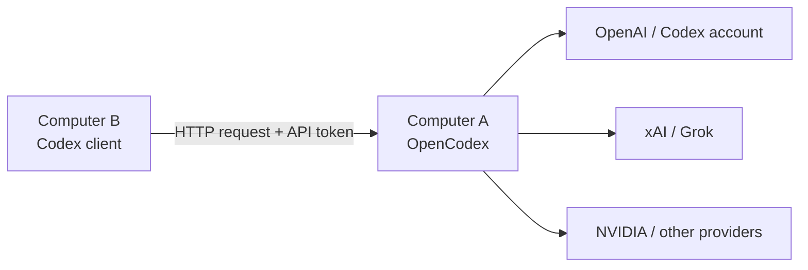

# OpenCodex LAN Codex Guide

> Run `opencodex` on Computer A, then let Codex on Computer B reuse its configured providers through a trusted local network.

[中文完整版](./README.md)

## Acknowledgement and Upstream Project

This guide is built around [lidge-jun/opencodex](https://github.com/lidge-jun/opencodex). Visit the upstream project for installation, licensing, and the latest OpenCodex features. If you share or adapt this guide, please keep the upstream link and credit the original project.

## Who Is This For?

Use this guide when Computer A runs `opencodex`, Computer B runs and signs in to `Codex`, and both computers are on the same trusted LAN. Computer B does not run a second OpenCodex service; it sends requests to Computer A.

## The Core Idea

Configure Codex on Computer B to use OpenCodex on Computer A as its model provider. Requests flow from B to A, then A forwards them to the upstream providers and accounts already configured there.

## Quick Start: Send These Two Instructions to Codex

Replace `<A_HOST_IP>` with Computer A's LAN IPv4 address and `<YOUR_API_TOKEN>` with a long random token you create. The token must be exactly the same on both computers. Use this only on a trusted LAN.

### Computer A: Host OpenCodex

```text
Please do this on this Windows computer: configure OpenCodex as a LAN server. Set its listen address to 0.0.0.0 and fixed port to 10100. Set the user environment variable OPENCODEX_API_AUTH_TOKEN=<YOUR_API_TOKEN>. Create a Windows Firewall inbound rule allowing TCP 10100, then restart OpenCodex. Verify that http://127.0.0.1:10100/healthz succeeds and report this computer's LAN IPv4 address. Do not write the token into public files and do not expose port 10100 directly to the public internet.
```

### Computer B: Connect Codex to Computer A

```text
Please do this on this Windows computer: configure Codex to connect to OpenCodex on Computer A over the LAN. Set the user environment variable OPENCODEX_API_AUTH_TOKEN=<YOUR_API_TOKEN>. Inspect and edit Codex config.toml: remove any root-level openai_base_url, set model_provider = "opencodex", and add or update [model_providers.opencodex] with base_url = "http://<A_HOST_IP>:10100/v1", wire_api = "responses", requires_openai_auth = true, and env_http_headers = { "x-opencodex-api-key" = "OPENCODEX_API_AUTH_TOKEN" }. Preserve or restore a usable model_catalog_json, restart Codex, then verify that http://<A_HOST_IP>:10100/api/providers returns 200. Do not write the token into public files.
```

## Architecture



Computer A owns the OpenCodex runtime, provider logins, the API token, and the firewall rule. Computer B owns its Codex client configuration and sends requests to A. A successful request is processed by the provider selected on B, but the actual account access happens on A.

## Configure Computer A

### 1. Listen on the LAN

Open OpenCodex's configuration file and ensure these values are present:

```json
{
  "port": 10100,
  "hostname": "0.0.0.0"
}
```

`0.0.0.0` accepts connections from LAN interfaces. Keep the fixed port so clients and health checks do not need to change after restarts.

### 2. Set the API Token

In PowerShell, set a long random value as a user environment variable:

```powershell
[Environment]::SetEnvironmentVariable('OPENCODEX_API_AUTH_TOKEN', '<YOUR_API_TOKEN>', 'User')
```

Restart the terminal or service after setting it. Never publish this token.

### 3. Start or Restart OpenCodex

Start it with its fixed port, for example:

```powershell
ocx start --port 10100
```

If you use a service or guard script, it must confirm OpenCodex's health endpoint and expected process, not merely check whether port 10100 is occupied.

### 4. Verify Locally

```powershell
Invoke-WebRequest http://127.0.0.1:10100/healthz
```

Expect a successful response before moving on.

### 5. Find Computer A's LAN Address

```powershell
ipconfig
```

Use the IPv4 address of the active LAN adapter as `<A_HOST_IP>`. Do not use `127.0.0.1` on Computer B.

### 6. Allow Windows Firewall Access

Run PowerShell as Administrator:

```powershell
New-NetFirewallRule -DisplayName "OpenCodex LAN 10100" -Direction Inbound -Action Allow -Protocol TCP -LocalPort 10100
```

### 7. Verify from the LAN

From Computer B, request:

```powershell
Invoke-WebRequest http://<A_HOST_IP>:10100/healthz
```

Do not continue until this succeeds.

## Configure Computer B

### 1. Confirm Network Reachability

```powershell
Test-NetConnection <A_HOST_IP> -Port 10100
Invoke-WebRequest http://<A_HOST_IP>:10100/healthz
```

The port test must succeed and the health endpoint must respond.

### 2. Set the Same Token

```powershell
[Environment]::SetEnvironmentVariable('OPENCODEX_API_AUTH_TOKEN', '<YOUR_API_TOKEN>', 'User')
```

The value must match Computer A exactly. Restart Codex after setting it.

### 3. Configure Codex

In Codex's `config.toml`, remove a conflicting root-level `openai_base_url` and use this provider configuration:

```toml
model_catalog_json = "C:\\path\\to\\opencodex-catalog.json"
model_provider = "opencodex"

[model_providers.opencodex]
name = "OpenCodex Proxy"
base_url = "http://<A_HOST_IP>:10100/v1"
wire_api = "responses"
requires_openai_auth = true
env_http_headers = { "x-opencodex-api-key" = "OPENCODEX_API_AUTH_TOKEN" }
```

Use a real existing catalog file path on Computer B. Do not put a token in this file.

### 4. Sync the Model Catalog

Ensure the `model_catalog_json` file exists on B and contains the models you want Codex to display. A missing or invalid catalog can make models disappear even when the LAN service is healthy.

### 5. Restart Codex

Close and reopen Codex. Select an OpenCodex-provided model and send a short test message.

## Verify the Setup

### Check 1: The Model List Appears

Codex on B should show models available through A. If it does not, check the catalog file, the provider block, and the token environment variable.

### Check 2: A Message Gets a Reply

Choose a model and send a simple message. A normal response confirms that requests can reach A and that A can reach the selected upstream provider.

### Check 3: Computer A Shows the Request

Check OpenCodex logs or usage records on A. A successful entry should show the selected provider/model and a successful HTTP status.

## Common Problems

### Models Appear but Messages Keep Reconnecting

This commonly means B can load metadata but has the wrong request route. Check that `model_provider = "opencodex"` is set, that the `base_url` uses A's LAN IP rather than `127.0.0.1`, that the root `openai_base_url` is removed, and that the token is available to the restarted Codex process.

### The Dashboard Asks for the Token Again

This is a dashboard authentication behavior, not a LAN routing failure. Store the token only in a secure local environment variable or password manager; do not disable authentication to avoid the prompt.

### The Port Changes After Restart

Set the fixed port in OpenCodex configuration and start it consistently. A guard script must verify `healthz`, the expected process, and the runtime port together; a bare “is port occupied?” check can preserve a wrong process.

## Minimal Diagnostic Order

On A: verify `http://127.0.0.1:10100/healthz`, confirm the configured port and LAN listener, and check the firewall rule.

On B: verify `http://<A_HOST_IP>:10100/healthz`, then confirm `OPENCODEX_API_AUTH_TOKEN`, `model_provider = "opencodex"`, the provider URL, and the model catalog.

Finally, inspect A's logs after a test message from B. This establishes whether the request reached A and which upstream provider handled it.

## Shareable Explanation

```text
One computer runs OpenCodex and exposes a trusted LAN port. Codex on another computer uses an OpenCodex model provider with the host's LAN URL, allowing it to reuse the host computer's configured models and provider accounts.
```

## Summary

Computer A runs and forwards. Computer B connects and uses. Keep account management on A, and B can use the same model capabilities through the LAN.
